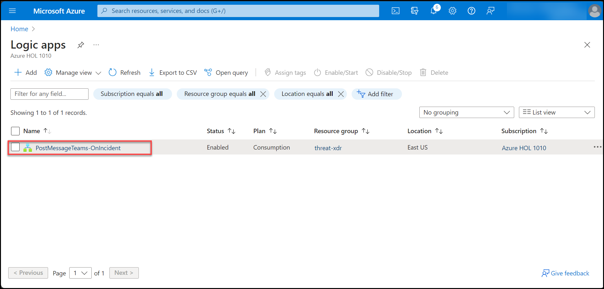
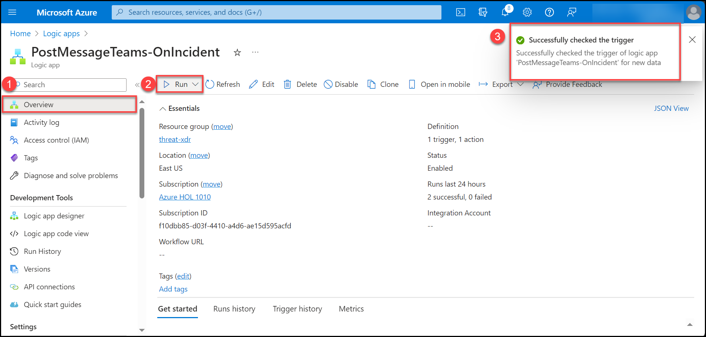

# Lab 11 - Integrate Logic App with Threat Protection and XDR

## Lab scenario

The integration of a Logic App with Threat Protection involves configuring triggers and actions to receive alerts, while interaction with XDR solutions requires adding actions to exchange data, perform analyses, and trigger responses. Implementing conditional checks and logic within the Logic App allows for tailored handling of received threat information, ensuring effective responses and workflow execution before thorough testing and deployment to production environments. 

## Lab objectives
 In this lab, you will perform the following:
 - Task 1: Create an Azure logic app
 - Task 2: Integrate logic app with Microsoft Defender for Cloud for threat notification.
## Estimated timing: 60 minutes

## Architecture Diagram

## Exersise 1: Integrate Logic App with Threat Protection and XDR

### Task 1: Create an Azure logic app

1. In the Azure portal, search for and select **Logic App** and, on the **Logic Apps** blade, select **+ Add** the select **Consumption**.

1. On the **Basics** tab of the **Logic App** blade, specify the following settings (leave others with their default values):

    | Setting | Value | 
    | --- | --- |
    | Subscription | the name of the Azure subscription you are using in this lab |
    | Resource group | select the existing resource group from drop down |
    | Logic App name | **PostMessageTeams-OnIncident** |
    | Region | Select region where you want to deploy logic app |
    | Select the location | select the location where resource group is deployed. |
    | Plan type | **Consumption** |

1. Select **Review + create** and then select **Create**. 

### Task 2: Integrate logic app with Microsoft Defender for Cloud for threat notification.

1. Select the Logic app **PostMessageTeams-OnIncident** to configure the workflow where we will set trigger event and proceeding action.
   

2.In the left pane under Development tools. Select **Logic app Designer**(1).Search for **Get a notification email when Microsoft Defender for Cloud detects a threat**(2).

3.Click on **Continue** to edit the workflow settings.

4.Under **Send an Email (V2)** logic app actions. Enter the **Email Id(1)** to which Alert notification should be sent and **Save(2)** the settings.

5. Navigate to **Overview(1)** and click on **Run(2)** to trigger the logic app. Once we successfully trigger the Logic app we will recieve **confirmation(3)**.

## Conclusion

When Microsoft Defender for Cloud detects any suspicious activity and threat. it will trigger an event in Azure logic apps which will sent an Email Notification to recipients with threat description.   

## Review
In this lab you have completed:
 - Create an Azure logic app
 - Integrate logic app with Microsoft Defender for Cloud for threat notification.

   
